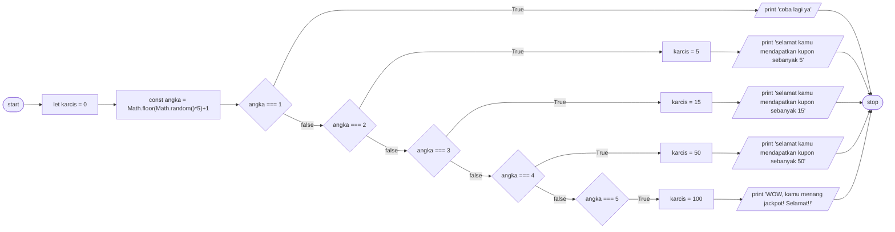

```mermaid
flowchart LR
    start([start])
    stop([stop])

    prosesKarcis["let karcis = 0"]
    prosesRandom["const angka = Math.floor(Math.random()*5)+1"]
    prosesAngka2["karcis = 5"]
    prosesAngka3["karcis = 15"]
    prosesAngka4["karcis = 50"]
    prosesAngka5["karcis = 100"]

    decisionAngka1{"angka === 1"}
    decisionAngka2{"angka === 2"}
    decisionAngka3{"angka === 3"}
    decisionAngka4{"angka === 4"}
    decisionAngka5{"angka === 5"}

    outputDecisionAngka1[/"print 'coba lagi ya'"/]
    outputDecisionAngka2[/"print 'selamat kamu mendapatkan kupon sebanyak 5'"/]
    outputDecisionAngka3[/"print 'selamat kamu mendapatkan kupon sebanyak 15'"/]
    outputDecisionAngka4[/"print 'selamat kamu mendapatkan kupon sebanyak 50'"/]
    outputDecisionAngka5[/"print 'WOW, kamu menang jackpot! Selamat!!'"/]

    start-->prosesKarcis-->prosesRandom
    prosesRandom-->decisionAngka1
    decisionAngka1--True-->outputDecisionAngka1
    decisionAngka1--false-->decisionAngka2
    decisionAngka2--True-->prosesAngka2-->outputDecisionAngka2
    decisionAngka2--false-->decisionAngka3
    decisionAngka3--True-->prosesAngka3-->outputDecisionAngka3
    decisionAngka3--false-->decisionAngka4
    decisionAngka4--True-->prosesAngka4-->outputDecisionAngka4
    decisionAngka4--false-->decisionAngka5
    decisionAngka5--True-->prosesAngka5-->outputDecisionAngka5
    outputDecisionAngka1-->stop
    outputDecisionAngka2-->stop
    outputDecisionAngka3-->stop
    outputDecisionAngka4-->stop
    outputDecisionAngka5-->stop
```
