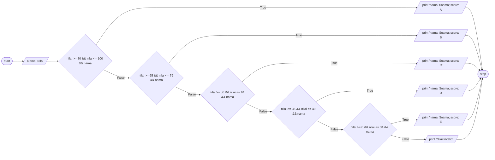

```mermaid
flowchart LR
    start([start])
    stop([stop])

    inputNamaNilai[/"Nama, Nilai"/]

    decisionNilaiA{"nilai >= 80 && nilai <= 100 && nama"}
    decisionNilaiB{"nilai >= 65 && nilai <= 79 && nama"}
    decisionNilaiC{"nilai >= 50 && nilai <= 64 && nama"}
    decisionNilaiD{"nilai >= 35 && nilai <= 49 && nama"}
    decisionNilaiE{"nilai >= 0 && nilai <= 34 && nama"}

    outputDecisionNilaiA[/"print 'nama: $nama; score: A'"/]
    outputDecisionNilaiB[/"print 'nama: $nama; score: B'"/]
    outputDecisionNilaiC[/"print 'nama: $nama; score: C'"/]
    outputDecisionNilaiD[/"print 'nama: $nama; score: D'"/]
    outputDecisionNilaiE[/"print 'nama: $nama; score: E'"/]
    outputDecisionDefault[/"print 'Nilai Invalid'"/]

    start-->inputNamaNilai-->decisionNilaiA
    decisionNilaiA--True-->outputDecisionNilaiA
    decisionNilaiA--False-->decisionNilaiB
    decisionNilaiB--True-->outputDecisionNilaiB
    decisionNilaiB--False-->decisionNilaiC
    decisionNilaiC--True-->outputDecisionNilaiC
    decisionNilaiC--False-->decisionNilaiD
    decisionNilaiD--True-->outputDecisionNilaiD
    decisionNilaiD--False-->decisionNilaiE
    decisionNilaiE--True-->outputDecisionNilaiE
    decisionNilaiE--False-->outputDecisionDefault
    outputDecisionNilaiA-->stop
    outputDecisionNilaiB-->stop
    outputDecisionNilaiC-->stop
    outputDecisionNilaiD-->stop
    outputDecisionNilaiE-->stop
    outputDecisionDefault-->stop
```
