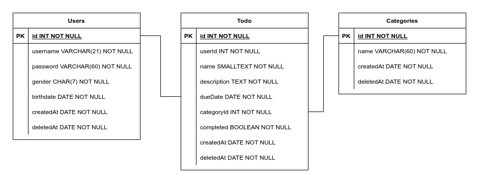

# chapter-05-todo-app

## Objectives

- Memahami cara menggunakan express untuk membuat API
- Memahami cara kerja middleware
- Memahami menggunakan sequelize untuk berinteraksi dengan database
- Memahami cara membuat dokumentasi menggunakan Swagger

## App requirement

### Features

Buatlah sebuah aplikasi yang berguna untuk mencatatkan semua hal-hal yang harus kalian lakukan (Todo App). Setiap data kegiatan yang ada wajib memiliki kategori. Aplikasi harus memiliki fitur-fitur sebagai berikut:

1. Registrasi user (atribut user dibebaskan, namun wajib ada username dan password)
2. Login user
3. Menambahkan data kegiatan yang harus dilakukan (atribut yang wajib ada adalah: nama, due date, kategori, dan completed (untuk menunjukkan apakah data kegiatan sudah dilakukan oleh user atau belum))
4. Mengedit data kegiatan (semua data bisa diubah, tapi buat validasi agar due date lebih besar dari hari ini)
5. Menampilkan data kegiatan berupa list dan detail (list hanya menampilkan nama dan completed saja)
6. Menghapus data kegiatan

Fitur tambahan (bisa dikerjakan di API list data kegiatan)

1. Buatlah fitur untuk filtering data kegiatan berdasarkan completed (sudah dikerjakan atau belum)
2. Buatlah fitur untuk filtering data kegiatan berdasarkan kategori
3. Buatlah fitur pagination

Semua fitur tambahan tidak wajib dikerjakan.

### Requirements

1. Kerjakan ERD nya dan cantumkan linknya di README.md
2. Buatlah database dan tabel-tablenya menggunakan sequelize
3. Wajib ada seeder
4. Buat API nya menggunakan express JS
5. Password user wajib di-enkrip / hash
6. Untuk token, gunakan JSOnWebToken
7. Wajib gunakan validasi saat membuat dan mengedit data kegiatan (semua field required)
8. Buat dokumentasinya menggunakan Swagger (wajib) dan Postman (tidak wajib)

### Deadline

Jumat, 15 April 2022 jam 21.15

### Link ERD



### Link Postman

```
https://documenter.getpostman.com/view/13454122/Uyr5pfPd
```
